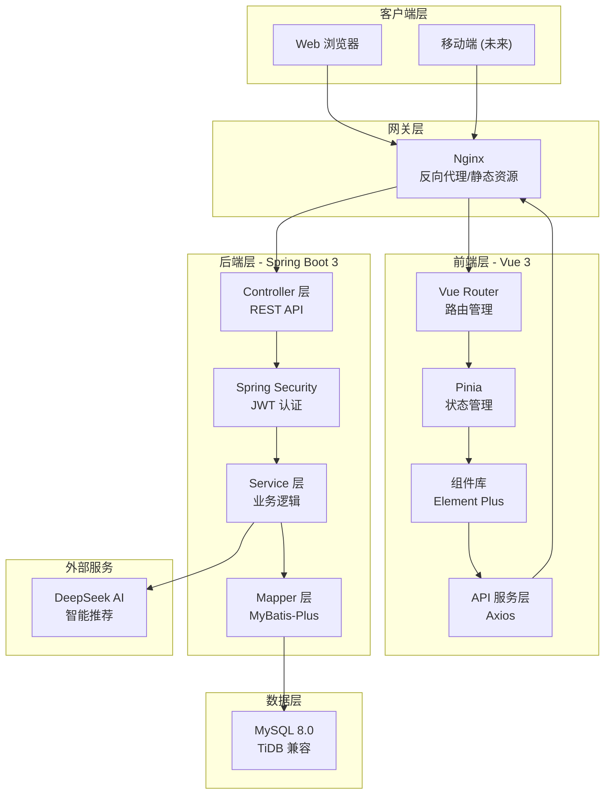
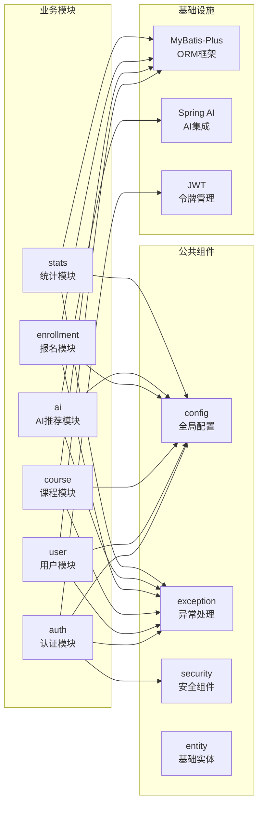
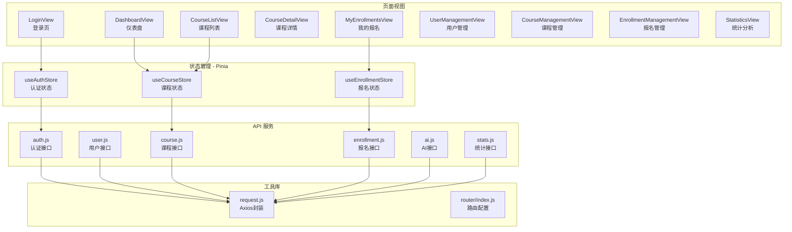
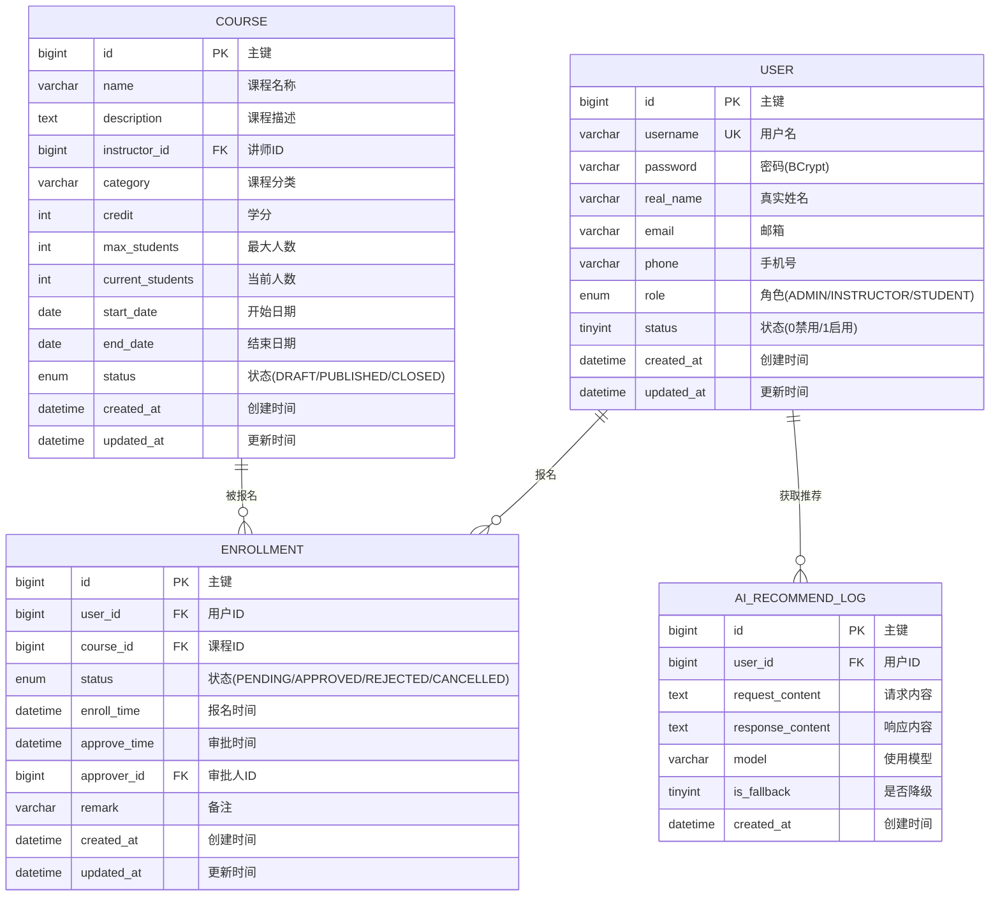
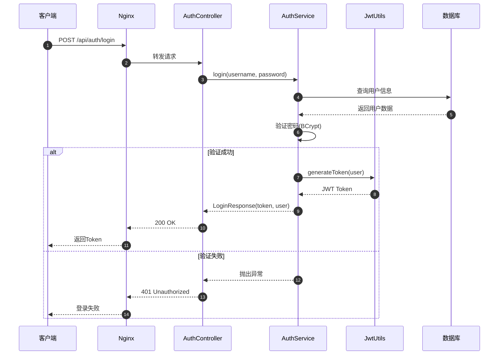
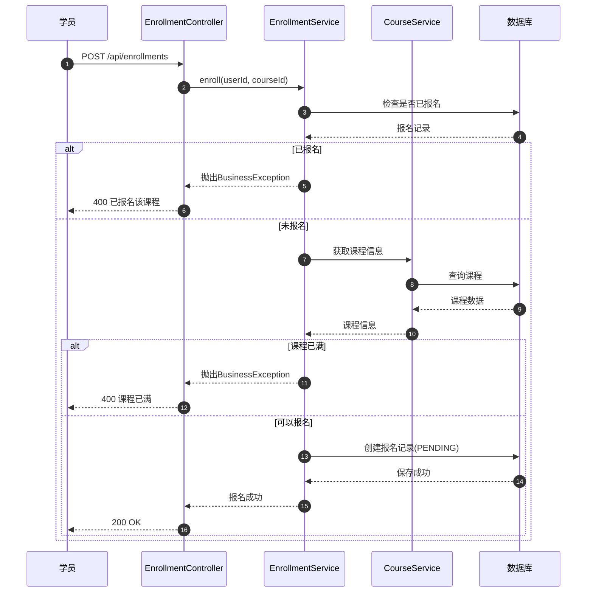
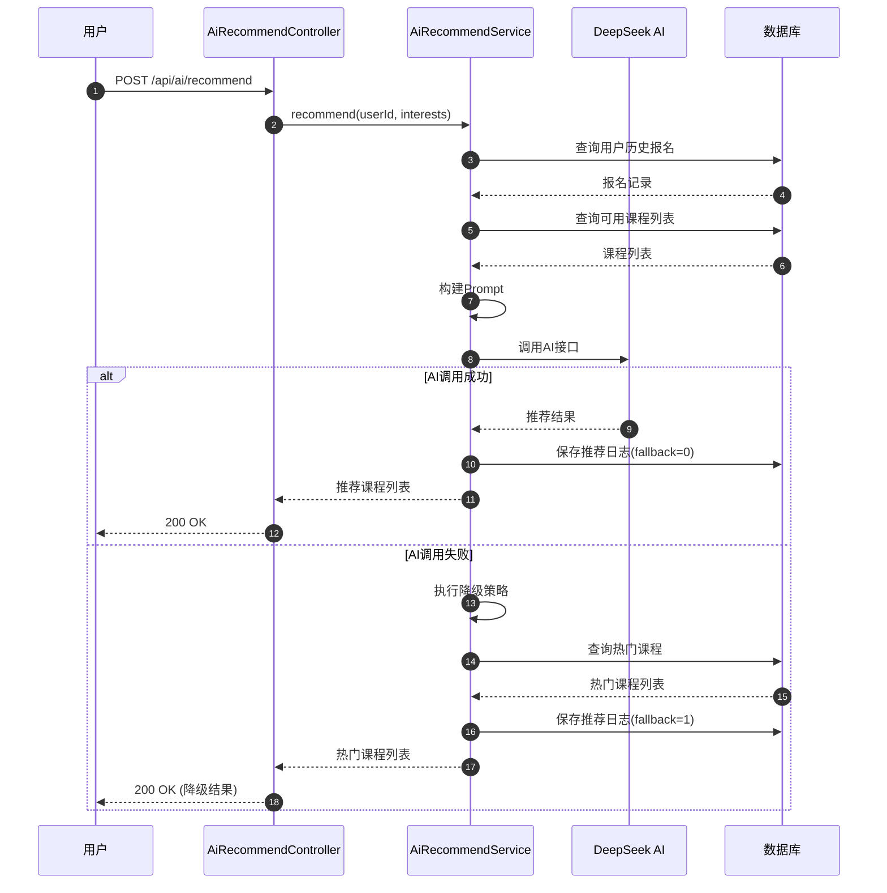
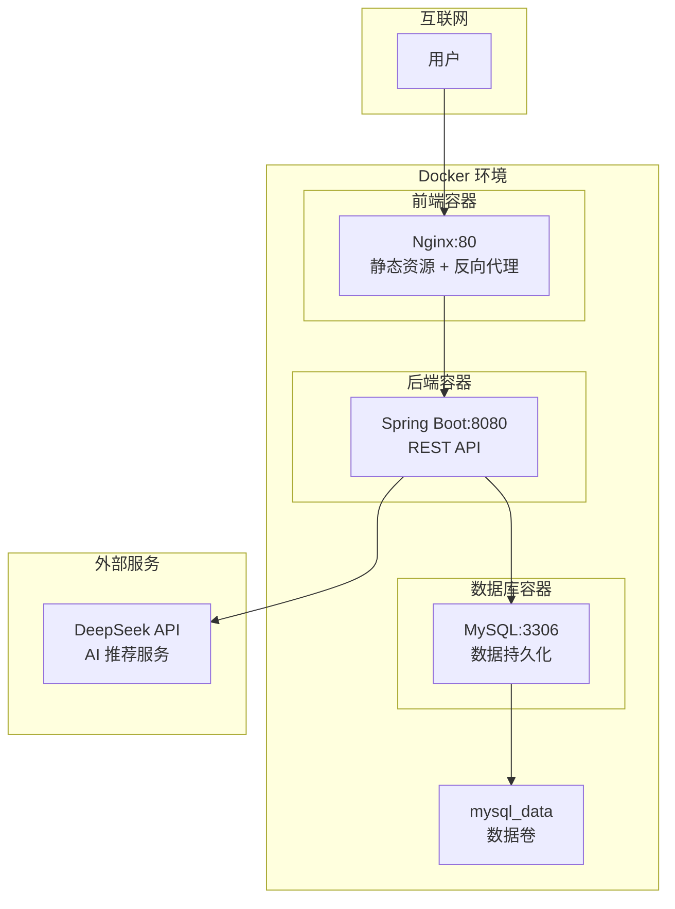

# IT技能培训智能选课系统 - 系统架构图

> 最后更新: 2025-12-14

---

## 1. 整体系统架构

---

## 2. 后端模块架构

---

## 3. 前端模块架构

---

## 4. 数据库 ER 图

---

## 5. 认证流程时序图

---

## 6. 课程报名流程时序图

---

## 7. AI 推荐流程时序图

---

## 8. 部署架构图

---

## 图表说明

| 图表 | 用途 | 适用场景 |
|------|------|----------|
| 整体系统架构 | 展示系统各层之间的关系 | 项目概览、技术选型说明 |
| 后端模块架构 | 展示后端代码组织结构 | 开发指南、代码导航 |
| 前端模块架构 | 展示前端代码组织结构 | 前端开发指南 |
| 数据库 ER 图 | 展示数据模型和关系 | 数据库设计、数据字典 |
| 认证流程时序图 | 展示登录认证过程 | 安全设计、接口对接 |
| 课程报名流程时序图 | 展示核心业务流程 | 业务理解、功能测试 |
| AI 推荐流程时序图 | 展示 AI 集成流程 | AI 功能说明、降级策略 |
| 部署架构图 | 展示容器化部署方案 | 运维部署、环境搭建 |
