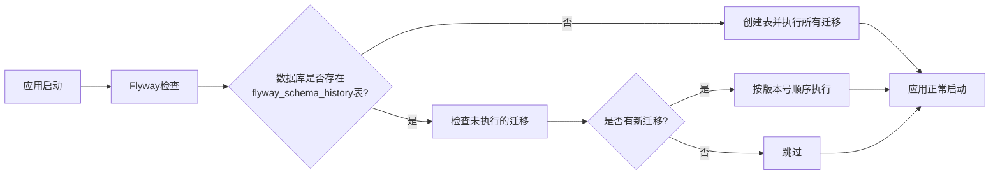

# IT技能培训智能选课系统 - 快速开始指南

## 一、环境准备

### 1.1 必需软件

| 软件 | 版本要求 | 下载地址 |
|------|---------|---------|
| JDK | 17+ | https://www.oracle.com/java/technologies/downloads/ |
| Node.js | 18+ | https://nodejs.org/ |
| TiDB | 7.5+ | https://www.pingcap.com/download/ |
| Redis | 7.0+ | https://redis.io/download |
| RocketMQ | 5.1+ | https://rocketmq.apache.org/download |
| Ollama | Latest | https://ollama.ai/ |
| Maven | 3.8+ | https://maven.apache.org/download.cgi |
| Git | Latest | https://git-scm.com/downloads |

### 1.2 开发工具（推荐）

- **后端开发**: IntelliJ IDEA Ultimate
- **前端开发**: Visual Studio Code
- **数据库管理**: Navicat / DBeaver
- **API测试**: Postman / Apifox
- **版本控制**: Git

---

## 二、项目初始化

### 2.1 克隆参考项目

```bash
# 克隆easy-enroll参考项目
git clone https://gitee.com/liy6/easy-enroll.git

# 查看项目结构
cd easy-enroll
tree -L 2
```

### 2.2 创建新项目

#### 方式一：基于参考项目改造

```bash
# 复制参考项目
cp -r easy-enroll it-training-system
cd it-training-system

# 重命名项目
# 修改 pom.xml 中的 artifactId 和 name
# 修改包名 com.ly.easyenroll -> com.ittraining

# 清理不需要的代码
rm -rf .git
git init
git add .
git commit -m "Initial commit"
```

#### 方式二：从零创建

**后端项目创建：**

1. 访问 https://start.spring.io/
2. 配置项目信息：
   - Project: Maven
   - Language: Java
   - Spring Boot: 3.4.x
   - Group: com.ittraining
   - Artifact: it-training-backend
   - Packaging: Jar
   - Java: 17

3. 添加依赖：
   - Spring Web
   - Spring Data JPA
   - MySQL Driver
   - Spring Data Redis
   - Lombok
   - Spring Security
   - Validation

4. 点击 Generate 下载项目

**前端项目创建：**

```bash
# 使用Vite创建Vue3项目
npm create vite@latest it-training-frontend -- --template vue

cd it-training-frontend
npm install

# 安装必要依赖
npm install vue-router@4 pinia element-plus axios
npm install -D sass
```

---

## 三、数据库初始化（使用Flyway）

### 3.1 为什么使用Flyway

由于使用TiDB分布式数据库，推荐使用Flyway进行数据库版本管理：

- ✅ **版本控制**：数据库结构变更可追溯
- ✅ **自动迁移**：应用启动时自动执行迁移脚本
- ✅ **团队协作**：避免数据库结构不一致
- ✅ **回滚支持**：支持数据库版本回退
- ✅ **TiDB兼容**：完全兼容TiDB（MySQL协议）

### 3.2 添加Flyway依赖

在 `pom.xml` 中添加Flyway依赖：

```xml
<dependency>
    <groupId>org.flywaydb</groupId>
    <artifactId>flyway-core</artifactId>
</dependency>
<dependency>
    <groupId>org.flywaydb</groupId>
    <artifactId>flyway-mysql</artifactId>
</dependency>
```

### 3.3 配置Flyway

在 `application.yml` 中添加Flyway配置：

```yaml
spring:
  flyway:
    enabled: true
    baseline-on-migrate: true
    locations: classpath:db/migration
    encoding: UTF-8
    validate-on-migrate: true
    out-of-order: false
```

### 3.4 创建数据库

首先手动创建数据库（只需执行一次）：

```bash
# 连接TiDB
mysql -h 127.0.0.1 -P 4000 -u root

# 创建数据库
CREATE DATABASE IF NOT EXISTS it_training
DEFAULT CHARACTER SET utf8mb4
DEFAULT COLLATE utf8mb4_unicode_ci;

# 退出
exit;
```

### 3.5 创建Flyway迁移脚本

在 `src/main/resources/db/migration/` 目录下创建迁移脚本：

**命名规范**：`V{版本号}__{描述}.sql`

#### V1__init_user_tables.sql
```sql
-- 用户相关表
CREATE TABLE `user` (
  `id` BIGINT PRIMARY KEY AUTO_INCREMENT COMMENT '用户ID',
  `username` VARCHAR(50) NOT NULL UNIQUE COMMENT '用户名',
  `password` VARCHAR(255) NOT NULL COMMENT '密码（加密）',
  `real_name` VARCHAR(50) COMMENT '真实姓名',
  `phone` VARCHAR(20) UNIQUE COMMENT '手机号',
  `email` VARCHAR(100) UNIQUE COMMENT '邮箱',
  `avatar` VARCHAR(255) COMMENT '头像URL',
  `gender` TINYINT COMMENT '性别：0-未知，1-男，2-女',
  `birth_date` DATE COMMENT '出生日期',
  `status` TINYINT DEFAULT 1 COMMENT '状态：0-禁用，1-正常',
  `create_time` DATETIME DEFAULT CURRENT_TIMESTAMP COMMENT '创建时间',
  `update_time` DATETIME DEFAULT CURRENT_TIMESTAMP ON UPDATE CURRENT_TIMESTAMP COMMENT '更新时间',
  INDEX idx_phone (`phone`),
  INDEX idx_email (`email`)
) ENGINE=InnoDB DEFAULT CHARSET=utf8mb4 COMMENT='用户表';

CREATE TABLE `role` (
  `id` BIGINT PRIMARY KEY AUTO_INCREMENT COMMENT '角色ID',
  `role_name` VARCHAR(50) NOT NULL UNIQUE COMMENT '角色名称',
  `role_code` VARCHAR(50) NOT NULL UNIQUE COMMENT '角色编码',
  `description` VARCHAR(255) COMMENT '角色描述',
  `status` TINYINT DEFAULT 1 COMMENT '状态：0-禁用，1-正常',
  `create_time` DATETIME DEFAULT CURRENT_TIMESTAMP COMMENT '创建时间',
  `update_time` DATETIME DEFAULT CURRENT_TIMESTAMP ON UPDATE CURRENT_TIMESTAMP COMMENT '更新时间'
) ENGINE=InnoDB DEFAULT CHARSET=utf8mb4 COMMENT='角色表';

CREATE TABLE `user_role` (
  `id` BIGINT PRIMARY KEY AUTO_INCREMENT COMMENT 'ID',
  `user_id` BIGINT NOT NULL COMMENT '用户ID',
  `role_id` BIGINT NOT NULL COMMENT '角色ID',
  `create_time` DATETIME DEFAULT CURRENT_TIMESTAMP COMMENT '创建时间',
  UNIQUE KEY uk_user_role (`user_id`, `role_id`),
  INDEX idx_user_id (`user_id`),
  INDEX idx_role_id (`role_id`)
) ENGINE=InnoDB DEFAULT CHARSET=utf8mb4 COMMENT='用户角色关联表';
```

#### V2__init_course_tables.sql
```sql
-- 课程相关表
CREATE TABLE `course_category` (
  `id` BIGINT PRIMARY KEY AUTO_INCREMENT COMMENT '分类ID',
  `category_name` VARCHAR(50) NOT NULL COMMENT '分类名称',
  `parent_id` BIGINT DEFAULT 0 COMMENT '父分类ID，0表示顶级分类',
  `sort_order` INT DEFAULT 0 COMMENT '排序',
  `icon` VARCHAR(255) COMMENT '图标',
  `description` VARCHAR(255) COMMENT '描述',
  `status` TINYINT DEFAULT 1 COMMENT '状态：0-禁用，1-正常',
  `create_time` DATETIME DEFAULT CURRENT_TIMESTAMP COMMENT '创建时间',
  `update_time` DATETIME DEFAULT CURRENT_TIMESTAMP ON UPDATE CURRENT_TIMESTAMP COMMENT '更新时间',
  INDEX idx_parent_id (`parent_id`)
) ENGINE=InnoDB DEFAULT CHARSET=utf8mb4 COMMENT='课程分类表';

CREATE TABLE `course` (
  `id` BIGINT PRIMARY KEY AUTO_INCREMENT COMMENT '课程ID',
  `course_name` VARCHAR(100) NOT NULL COMMENT '课程名称',
  `course_code` VARCHAR(50) UNIQUE COMMENT '课程编码',
  `category_id` BIGINT NOT NULL COMMENT '分类ID',
  `teacher_id` BIGINT NOT NULL COMMENT '讲师ID',
  `cover_image` VARCHAR(255) COMMENT '封面图片',
  `description` TEXT COMMENT '课程简介',
  `difficulty_level` TINYINT COMMENT '难度等级：1-入门，2-初级，3-中级，4-高级，5-专家',
  `duration` INT COMMENT '课程时长（分钟）',
  `price` DECIMAL(10,2) DEFAULT 0.00 COMMENT '课程价格',
  `original_price` DECIMAL(10,2) COMMENT '原价',
  `max_students` INT DEFAULT 0 COMMENT '最大学员数，0表示不限制',
  `enrolled_count` INT DEFAULT 0 COMMENT '已选人数',
  `stock` INT DEFAULT 0 COMMENT '库存',
  `version` INT DEFAULT 0 COMMENT '版本号（乐观锁）',
  `view_count` INT DEFAULT 0 COMMENT '浏览次数',
  `rating` DECIMAL(3,2) DEFAULT 0.00 COMMENT '评分（0-5）',
  `rating_count` INT DEFAULT 0 COMMENT '评分人数',
  `status` TINYINT DEFAULT 0 COMMENT '状态：0-草稿，1-已发布，2-已下架',
  `is_hot` TINYINT DEFAULT 0 COMMENT '是否热门：0-否，1-是',
  `is_recommend` TINYINT DEFAULT 0 COMMENT '是否推荐：0-否，1-是',
  `start_time` DATETIME COMMENT '开课时间',
  `end_time` DATETIME COMMENT '结课时间',
  `create_time` DATETIME DEFAULT CURRENT_TIMESTAMP COMMENT '创建时间',
  `update_time` DATETIME DEFAULT CURRENT_TIMESTAMP ON UPDATE CURRENT_TIMESTAMP COMMENT '更新时间',
  INDEX idx_category_id (`category_id`),
  INDEX idx_teacher_id (`teacher_id`),
  INDEX idx_status (`status`),
  INDEX idx_stock (`stock`),
  INDEX idx_start_time (`start_time`)
) ENGINE=InnoDB DEFAULT CHARSET=utf8mb4 COMMENT='课程表';
```

#### V3__init_enrollment_tables.sql
```sql
-- 选课相关表
CREATE TABLE `enrollment` (
  `id` BIGINT PRIMARY KEY AUTO_INCREMENT COMMENT '选课ID',
  `student_id` BIGINT NOT NULL COMMENT '学员ID',
  `course_id` BIGINT NOT NULL COMMENT '课程ID',
  `order_id` BIGINT COMMENT '订单ID',
  `enrollment_time` DATETIME DEFAULT CURRENT_TIMESTAMP COMMENT '选课时间',
  `status` TINYINT DEFAULT 1 COMMENT '状态：0-已取消，1-学习中，2-已完成',
  `progress` DECIMAL(5,2) DEFAULT 0.00 COMMENT '学习进度（百分比）',
  `study_duration` INT DEFAULT 0 COMMENT '学习时长（分钟）',
  `last_study_time` DATETIME COMMENT '最后学习时间',
  `complete_time` DATETIME COMMENT '完成时间',
  `score` DECIMAL(5,2) COMMENT '成绩',
  `certificate_url` VARCHAR(255) COMMENT '证书URL',
  `create_time` DATETIME DEFAULT CURRENT_TIMESTAMP COMMENT '创建时间',
  `update_time` DATETIME DEFAULT CURRENT_TIMESTAMP ON UPDATE CURRENT_TIMESTAMP COMMENT '更新时间',
  UNIQUE KEY uk_student_course (`student_id`, `course_id`),
  INDEX idx_student_id (`student_id`),
  INDEX idx_course_id (`course_id`),
  INDEX idx_status (`status`)
) ENGINE=InnoDB DEFAULT CHARSET=utf8mb4 COMMENT='选课记录表';
```

#### V4__init_data.sql
```sql
-- 初始化数据
INSERT INTO `role` (role_name, role_code, description) VALUES
('管理员', 'ADMIN', '系统管理员'),
('教师', 'TEACHER', '课程讲师'),
('学员', 'STUDENT', '普通学员');

-- 插入默认管理员（密码：admin123，需要使用BCrypt加密）
INSERT INTO `user` (username, password, real_name, phone, email, status)
VALUES ('admin', '$2a$10$N.zmdr9k7uOCQb376NoUnuTJ8iAt6Z5EHsM8lE9lBOsl7iAt6Z5EH', '系统管理员', '13800138000', 'admin@example.com', 1);

-- 关联管理员角色
INSERT INTO `user_role` (user_id, role_id) VALUES (1, 1);

-- 插入课程分类
INSERT INTO `course_category` (category_name, parent_id, sort_order) VALUES
('前端开发', 0, 1),
('后端开发', 0, 2),
('移动开发', 0, 3),
('数据库', 0, 4),
('人工智能', 0, 5);
```

### 3.6 Flyway工作流程



### 3.7 Flyway常用命令

```bash
# 查看迁移状态
mvn flyway:info

# 手动执行迁移
mvn flyway:migrate

# 验证迁移脚本
mvn flyway:validate

# 清空数据库（慎用！）
mvn flyway:clean

# 修复迁移历史
mvn flyway:repair
```

### 3.8 迁移脚本最佳实践

1. **版本号规则**
   - V1, V2, V3... 用于结构变更
   - V1.1, V1.2... 用于小版本修复
   - 版本号必须唯一且递增

2. **文件命名**
   ```
   V1__init_user_tables.sql
   V2__init_course_tables.sql
   V3__init_enrollment_tables.sql
   V4__init_data.sql
   V5__add_column_to_course.sql
   ```

3. **脚本编写原则**
   - 每个脚本只做一件事
   - 脚本必须幂等（可重复执行）
   - 不要修改已执行的脚本
   - 使用事务保证原子性

4. **TiDB特殊注意**
   - TiDB完全兼容MySQL语法
   - 支持AUTO_INCREMENT
   - 支持外键语法但不强制约束
   - 建议使用索引优化查询

---

## 四、后端配置

### 4.1 配置文件

创建 `src/main/resources/application.yml`:

```yaml
spring:
  application:
    name: it-training-backend
  
  # 数据源配置（TiDB兼容MySQL协议，使用4000端口）
  datasource:
    driver-class-name: com.mysql.cj.jdbc.Driver
    url: jdbc:mysql://localhost:4000/it_training?useUnicode=true&characterEncoding=utf8&useSSL=false&serverTimezone=Asia/Shanghai
    username: root
    password: your_password
  
  # Flyway数据库迁移配置
  flyway:
    enabled: true
    baseline-on-migrate: true
    locations: classpath:db/migration
    encoding: UTF-8
    validate-on-migrate: true
    out-of-order: false
    baseline-version: 0
    baseline-description: "Initial baseline"
    
  # Redis配置
  data:
    redis:
      host: localhost
      port: 6379
      password:
      database: 0
      lettuce:
        pool:
          max-active: 8
          max-idle: 8
          min-idle: 0
          max-wait: -1ms
  
  # 文件上传配置
  servlet:
    multipart:
      max-file-size: 100MB
      max-request-size: 100MB

# MyBatis配置
mybatis:
  mapper-locations: classpath:mapper/*.xml
  type-aliases-package: com.ittraining.entity
  configuration:
    map-underscore-to-camel-case: true
    log-impl: org.apache.ibatis.logging.stdout.StdOutImpl

# RocketMQ配置
rocketmq:
  name-server: localhost:9876
  producer:
    group: enrollment-producer-group
    send-message-timeout: 3000

# Redisson配置
spring:
  redis:
    redisson:
      config: |
        singleServerConfig:
          address: "redis://localhost:6379"
          database: 0

# Spring AI配置
spring:
  ai:
    ollama:
      base-url: http://localhost:11434
      chat:
        options:
          model: qwen3
          temperature: 0.7

# JWT配置
jwt:
  secret: your-secret-key-change-this-in-production
  expiration: 86400000  # 24小时

# 服务器配置
server:
  port: 8080
  servlet:
    context-path: /api

# 日志配置
logging:
  level:
    com.ittraining: debug
    org.springframework: info
  file:
    name: logs/it-training.log
```

### 4.2 启动类配置

```java
package com.ittraining;

import org.mybatis.spring.annotation.MapperScan;
import org.springframework.boot.SpringApplication;
import org.springframework.boot.autoconfigure.SpringBootApplication;
import org.springframework.scheduling.annotation.EnableAsync;
import org.springframework.scheduling.annotation.EnableScheduling;

@SpringBootApplication
@MapperScan("com.ittraining.mapper")
@EnableAsync
@EnableScheduling
public class ItTrainingApplication {
    public static void main(String[] args) {
        SpringApplication.run(ItTrainingApplication.class, args);
    }
}
```

---

## 五、前端配置

### 5.1 环境变量

创建 `.env.development`:

```env
# 开发环境配置
VITE_APP_TITLE=IT技能培训智能选课系统
VITE_APP_BASE_API=http://localhost:8080/api
VITE_APP_UPLOAD_URL=http://localhost:8080/api/upload
```

创建 `.env.production`:

```env
# 生产环境配置
VITE_APP_TITLE=IT技能培训智能选课系统
VITE_APP_BASE_API=https://your-domain.com/api
VITE_APP_UPLOAD_URL=https://your-domain.com/api/upload
```

### 5.2 Vite配置

创建 `vite.config.js`:

```javascript
import { defineConfig } from 'vite'
import vue from '@vitejs/plugin-vue'
import path from 'path'

export default defineConfig({
  plugins: [vue()],
  resolve: {
    alias: {
      '@': path.resolve(__dirname, 'src')
    }
  },
  server: {
    port: 3000,
    proxy: {
      '/api': {
        target: 'http://localhost:8080',
        changeOrigin: true,
        rewrite: (path) => path.replace(/^\/api/, '')
      }
    }
  }
})
```

### 5.3 路由配置

创建 `src/router/index.js`:

```javascript
import { createRouter, createWebHistory } from 'vue-router'
import { getToken } from '@/utils/auth'

const routes = [
  {
    path: '/login',
    name: 'Login',
    component: () => import('@/views/auth/Login.vue')
  },
  {
    path: '/',
    redirect: '/home'
  },
  {
    path: '/home',
    name: 'Home',
    component: () => import('@/views/student/Home.vue'),
    meta: { requiresAuth: true }
  },
  {
    path: '/courses',
    name: 'CourseList',
    component: () => import('@/views/student/CourseList.vue'),
    meta: { requiresAuth: true }
  }
]

const router = createRouter({
  history: createWebHistory(),
  routes
})

// 路由守卫
router.beforeEach((to, from, next) => {
  const token = getToken()
  
  if (to.meta.requiresAuth && !token) {
    next('/login')
  } else {
    next()
  }
})

export default router
```

---

## 六、中间件安装与配置

### 6.1 TiDB安装

**使用TiUP（推荐）：**
```bash
# 安装TiUP
curl --proto '=https' --tlsv1.2 -sSf https://tiup-mirrors.pingcap.com/install.sh | sh

# 启动本地TiDB集群（适合开发测试）
tiup playground

# 或启动指定版本
tiup playground v7.5.0

# TiDB会在4000端口启动，可以使用MySQL客户端连接
mysql -h 127.0.0.1 -P 4000 -u root
```

**使用Docker（快速体验）：**
```bash
# 拉取TiDB镜像
docker pull pingcap/tidb:v7.5.0

# 启动TiDB
docker run -d --name tidb-server -p 4000:4000 -p 10080:10080 pingcap/tidb:v7.5.0

# 连接TiDB
mysql -h 127.0.0.1 -P 4000 -u root
```

### 6.2 Redis安装

**Windows:**
```bash
# 下载Redis for Windows
# 解压后运行
redis-server.exe redis.windows.conf
```

**Linux:**
```bash
# Ubuntu/Debian
sudo apt install redis-server
sudo systemctl start redis

# CentOS/RHEL
sudo yum install redis
sudo systemctl start redis
```

### 6.3 RocketMQ安装

```bash
# 下载RocketMQ
wget https://dist.apache.org/repos/dist/release/rocketmq/5.1.0/rocketmq-all-5.1.0-bin-release.zip
unzip rocketmq-all-5.1.0-bin-release.zip
cd rocketmq-5.1.0

# 启动NameServer
nohup sh bin/mqnamesrv &

# 启动Broker
nohup sh bin/mqbroker -n localhost:9876 &

# 验证
sh bin/mqadmin clusterList -n localhost:9876
```

### 6.4 Ollama安装与配置

```bash
# Linux/Mac
curl -fsSL https://ollama.ai/install.sh | sh

# Windows
# 下载安装包：https://ollama.ai/download

# 启动Ollama服务
ollama serve

# 下载Qwen3模型
ollama pull qwen3

# 测试模型
ollama run qwen3 "你好"
```

---

## 七、项目启动

### 7.1 启动后端

```bash
# 方式一：使用Maven
cd it-training-backend
mvn clean install
mvn spring-boot:run

# 方式二：使用IDEA
# 打开项目 -> 找到主类 -> 右键 Run

# 验证启动
curl http://localhost:8080/api/health
```

### 7.2 启动前端

```bash
cd it-training-frontend

# 安装依赖
npm install

# 启动开发服务器
npm run dev

# 访问
# 浏览器打开 http://localhost:3000
```

### 7.3 验证系统

1. **访问前端页面**: http://localhost:3000
2. **登录系统**: 
   - 用户名: admin
   - 密码: admin123
3. **查看API文档**: http://localhost:8080/api/swagger-ui.html
4. **测试AI功能**: 访问AI对话页面

---

## 八、开发工作流

### 8.1 Git工作流

```bash
# 创建功能分支
git checkout -b feature/user-management

# 开发并提交
git add .
git commit -m "feat: 实现用户管理功能"

# 推送到远程
git push origin feature/user-management

# 合并到主分支
git checkout main
git merge feature/user-management
```

### 8.2 代码规范

**后端代码规范：**
- 遵循阿里巴巴Java开发手册
- 使用Lombok简化代码
- 统一异常处理
- 添加必要注释

**前端代码规范：**
- 遵循Vue3官方风格指南
- 使用ESLint检查代码
- 组件命名使用PascalCase
- 方法命名使用camelCase

### 8.3 测试流程

```bash
# 后端单元测试
mvn test

# 前端单元测试
npm run test

# 集成测试
# 使用Postman导入API集合进行测试
```

---

## 九、常见问题解决

### 9.1 数据库连接失败

**问题**: `Communications link failure`

**解决**:
```yaml
# 检查TiDB是否启动
tiup status

# 检查端口是否开放（TiDB使用4000端口）
netstat -an | grep 4000

# 修改配置文件中的连接信息
spring:
  datasource:
    url: jdbc:mysql://localhost:4000/it_training?useSSL=false&serverTimezone=Asia/Shanghai
```

### 9.2 Redis连接失败

**问题**: `Unable to connect to Redis`

**解决**:
```bash
# 检查Redis是否启动
redis-cli ping

# 如果返回PONG则正常
# 检查防火墙设置
sudo ufw allow 6379
```

### 9.3 RocketMQ启动失败

**问题**: `Name server startup failed`

**解决**:
```bash
# 检查Java环境
java -version

# 增加JVM内存
export JAVA_OPT="-server -Xms512m -Xmx512m"

# 重新启动
sh bin/mqnamesrv
```

### 9.4 Ollama模型加载慢

**问题**: AI响应时间过长

**解决**:
```bash
# 预加载模型
ollama run qwen3

# 调整模型参数
spring:
  ai:
    ollama:
      chat:
        options:
          num_ctx: 2048  # 减小上下文窗口
          temperature: 0.5  # 降低随机性
```

### 9.5 前端跨域问题

**问题**: `CORS policy blocked`

**解决**:
```java
// 后端添加CORS配置
@Configuration
public class CorsConfig {
    @Bean
    public CorsFilter corsFilter() {
        CorsConfiguration config = new CorsConfiguration();
        config.addAllowedOrigin("http://localhost:3000");
        config.addAllowedMethod("*");
        config.addAllowedHeader("*");
        config.setAllowCredentials(true);
        
        UrlBasedCorsConfigurationSource source = new UrlBasedCorsConfigurationSource();
        source.registerCorsConfiguration("/**", config);
        return new CorsFilter(source);
    }
}
```

---

## 十、下一步计划

### 10.1 立即开始

1. ✅ 安装所有必需软件
2. ✅ 创建数据库并初始化
3. ✅ 配置后端项目
4. ✅ 配置前端项目
5. ✅ 启动并验证系统

### 10.2 第一周任务

- [ ] 实现用户注册登录功能
- [ ] 实现JWT认证
- [ ] 开发课程列表页面
- [ ] 实现课程搜索功能

### 10.3 学习资源

**官方文档：**
- Spring Boot: https://spring.io/projects/spring-boot
- Vue 3: https://vuejs.org/
- Element Plus: https://element-plus.org/
- Spring AI: https://docs.spring.io/spring-ai/reference/

**视频教程：**
- B站搜索"SpringBoot3教程"
- B站搜索"Vue3实战教程"

**社区支持：**
- Stack Overflow
- GitHub Issues
- 掘金社区
- CSDN

---

## 十一、项目检查清单

### 开发环境检查

- [ ] JDK 17已安装并配置环境变量
- [ ] Node.js 18+已安装
- [ ] TiDB 7.5+已安装并启动
- [ ] Redis已安装并启动
- [ ] RocketMQ已安装并启动
- [ ] Ollama已安装并下载Qwen3模型
- [ ] IDEA/VS Code已安装并配置

### 项目配置检查

- [ ] 数据库已创建并初始化
- [ ] 后端配置文件已正确配置
- [ ] 前端环境变量已配置
- [ ] Maven依赖已下载
- [ ] npm依赖已安装

### 功能验证检查

- [ ] 后端服务启动成功
- [ ] 前端服务启动成功
- [ ] 数据库连接正常
- [ ] Redis连接正常
- [ ] RocketMQ连接正常
- [ ] Ollama AI服务正常
- [ ] 登录功能正常
- [ ] API接口调用正常

---

## 十二、联系与支持

如果在项目搭建过程中遇到问题，可以：

1. 查看项目文档：`/plans` 目录下的所有文档
2. 查看参考项目：https://gitee.com/liy6/easy-enroll
3. 搜索相关技术文档
4. 在GitHub/Gitee上提Issue

**祝你开发顺利！🚀**