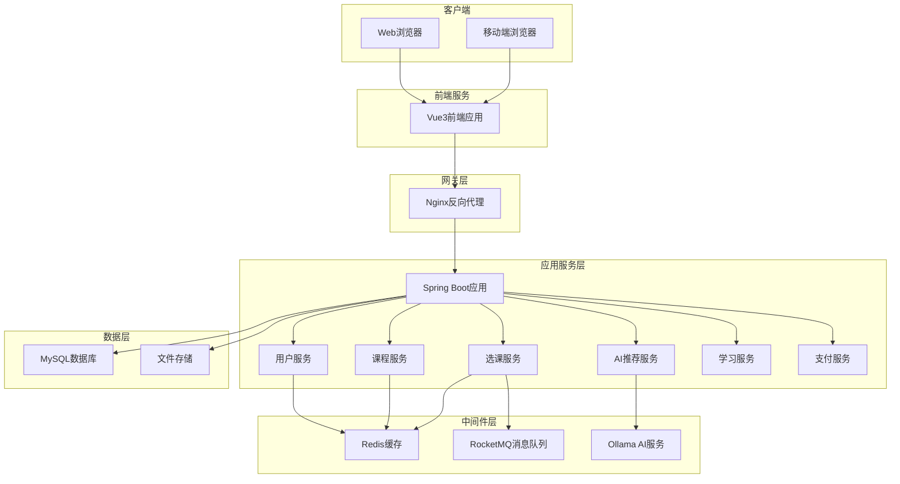
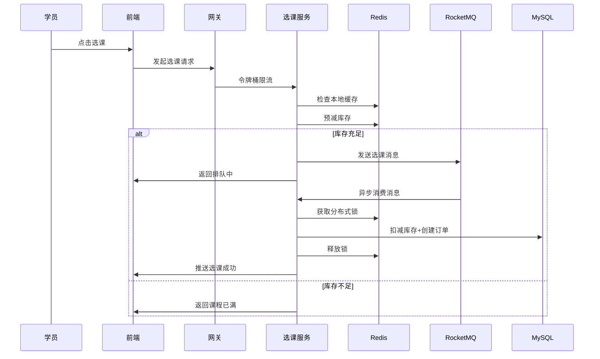

# IT技能培训智能选课系统 - 详细设计方案

> 基于 SpringBoot 3.x + Vue 3 + AI 的毕业设计项目
> 参考项目：https://gitee.com/liy6/easy-enroll


## 一、项目概述

### 1.1 项目背景
本项目是一个基于SpringBoot和Vue的IT技能培训智能选课系统，面向IT技能培训机构和学员，提供智能化的课程选择、学习管理和技能评估服务。

### 1.2 项目目标
- 实现高效的课程管理和选课功能
- 集成AI智能推荐，提供个性化课程建议
- 支持在线学习、技能评估和证书管理
- 提供良好的用户体验和系统性能

### 1.3 参考项目
基于 https://gitee.com/liy6/easy-enroll 项目进行改造和扩展

---

## 二、核心功能模块设计

### 2.1 用户管理模块
#### 角色定义
- **学员（Student）**
  - 浏览课程、选课退课
  - 查看学习进度和成绩
  - 获取AI推荐课程
  - 参与在线测试
  - 下载学习证书

- **讲师（Teacher）**
  - 发布和管理课程
  - 查看学员学习情况
  - 批改作业和评分
  - 发布课程资料
  - 统计教学数据

- **管理员（Admin）**
  - 用户管理（增删改查）
  - 课程审核和管理
  - 系统配置
  - 数据统计分析
  - 公告发布

#### 功能清单
- 用户注册/登录（支持手机号、邮箱）
- 个人信息管理
- 角色权限控制
- 密码找回
- 用户头像上传

### 2.2 课程管理模块
#### 课程信息
- 课程基本信息（名称、简介、封面、难度等级）
- 课程分类（前端、后端、移动端、数据库、AI等）
- 课程标签（技能点标签）
- 课程大纲（章节结构）
- 课程资源（视频、文档、代码）
- 课程评价和评分

#### 功能清单
- 课程发布和编辑
- 课程分类管理
- 课程搜索和筛选
- 课程详情展示
- 课程评价系统
- 热门课程推荐

### 2.3 选课管理模块
#### 核心功能
- **智能选课**
  - 基于学员技能水平的课程推荐
  - 基于学习目标的路径规划
  - 课程冲突检测
  - 前置课程检查

- **选课流程**
  - 浏览课程列表
  - 加入购物车
  - 提交选课申请
  - 支付学费（可选）
  - 确认选课

- **高并发处理**（参考easy-enroll）
  - Redis预缓存课程库存
  - 令牌桶限流
  - RocketMQ异步处理
  - Redisson分布式锁
  - 三级防重校验

#### 功能清单
- 选课/退课
- 我的课程列表
- 课程进度跟踪
- 学习日历
- 选课历史记录

### 2.4 AI智能推荐模块
#### 推荐策略
- **基于内容的推荐**
  - 根据课程标签和技能点匹配
  - 分析课程难度和学员水平
  
- **协同过滤推荐**
  - 基于相似学员的选课记录
  - 基于课程的关联性

- **学习路径推荐**
  - 根据职业目标规划课程序列
  - 技能树导向的课程推荐

#### 技术实现（参考easy-enroll）
- Spring AI + Ollama
- Qwen3大模型
- 对话式AI交互
- 多维度推荐算法

#### 功能清单
- 个性化课程推荐
- 学习路径规划
- AI对话助手
- 智能问答

### 2.5 学习管理模块
#### 学习功能
- 在线视频播放
- 课程资料下载
- 学习笔记
- 学习进度记录
- 课程打卡

#### 互动功能
- 课程讨论区
- 问答社区
- 作业提交
- 在线答疑

#### 功能清单
- 视频学习
- 资料管理
- 笔记系统
- 讨论区
- 作业系统

### 2.6 技能评估模块
#### 评估方式
- **在线测试**
  - 选择题、判断题、填空题
  - 编程题（代码评测）
  - 定时考试
  - 自动评分

- **技能认证**
  - 课程完成证书
  - 技能等级认证
  - 项目实战认证

- **技能树系统**
  - 可视化技能图谱
  - 技能点解锁机制
  - 学习成就系统

#### 功能清单
- 在线测试
- 成绩管理
- 证书生成
- 技能树展示
- 学习报告

### 2.7 支付管理模块（可选）
#### 支付功能
- 课程付费
- 会员充值
- 订单管理
- 退款处理

#### 技术实现（参考easy-enroll）
- 支付宝沙箱支付
- 异步回调处理
- 订单状态同步
- 幂等性保证

#### 功能清单
- 在线支付
- 订单查询
- 支付记录
- 发票管理

### 2.8 数据统计模块
#### 统计维度
- 学员学习数据
- 课程热度统计
- 讲师教学数据
- 系统运营数据

#### 功能清单
- 数据看板
- 学习报表
- 课程分析
- 用户画像
- 导出Excel

### 2.9 系统管理模块
#### 管理功能
- 系统配置
- 公告管理
- 日志管理
- 权限管理
- 数据备份

#### 功能清单
- 系统设置
- 公告发布
- 操作日志
- 角色权限
- 数据维护

---

## 三、系统架构设计

### 3.1 技术架构

```
前端层（Vue3 + Element Plus）
    ↓
API网关层（Nginx）
    ↓
应用层（Spring Boot 3.x）
    ↓
服务层（业务逻辑）
    ↓
数据层（MySQL + Redis + RocketMQ）
```

### 3.2 技术选型

#### 后端技术栈
| 技术 | 版本 | 说明 |
|------|------|------|
| Spring Boot | 3.4.x | 核心框架 |
| Spring Security | 6.x | 安全框架 |
| MyBatis | 3.0.x | ORM框架 |
| TiDB | 7.5+ | 分布式关系数据库 |
| Redis | 7.x | 缓存数据库 |
| RocketMQ | 5.x | 消息队列 |
| Redisson | 3.27.x | 分布式锁 |
| Spring AI | 1.0.0 | AI集成框架 |
| Ollama | Latest | 本地大模型 |
| JWT | 0.12.x | 身份认证 |
| Hutool | 5.8.x | 工具类库 |
| EasyExcel | 3.3.x | Excel处理 |
| PageHelper | 1.4.x | 分页插件 |
| Caffeine | 3.1.x | 本地缓存 |
| Alipay SDK | 4.38.x | 支付宝支付 |

#### 前端技术栈
| 技术 | 版本 | 说明 |
|------|------|------|
| Vue | 3.x | 前端框架 |
| Vue Router | 4.x | 路由管理 |
| Pinia | 2.x | 状态管理 |
| Element Plus | 2.x | UI组件库 |
| Axios | 1.x | HTTP客户端 |
| ECharts | 5.x | 数据可视化 |
| Video.js | 8.x | 视频播放器 |
| Markdown-it | 14.x | Markdown渲染 |
| Vite | 5.x | 构建工具 |

#### 开发工具
- IDE: IntelliJ IDEA / VS Code
- 版本控制: Git
- 接口文档: Swagger / Apifox
- 数据库工具: Navicat / DBeaver
- 容器化: Docker
- 反向代理: Nginx

### 3.3 系统架构图



### 3.4 高并发选课架构（核心亮点）



---

## 四、数据库设计

### 4.1 核心数据表

#### 用户相关表

**1. 用户表（user）**
```sql
CREATE TABLE `user` (
  `id` BIGINT PRIMARY KEY AUTO_INCREMENT COMMENT '用户ID',
  `username` VARCHAR(50) NOT NULL UNIQUE COMMENT '用户名',
  `password` VARCHAR(255) NOT NULL COMMENT '密码（加密）',
  `real_name` VARCHAR(50) COMMENT '真实姓名',
  `phone` VARCHAR(20) UNIQUE COMMENT '手机号',
  `email` VARCHAR(100) UNIQUE COMMENT '邮箱',
  `avatar` VARCHAR(255) COMMENT '头像URL',
  `gender` TINYINT COMMENT '性别：0-未知，1-男，2-女',
  `birth_date` DATE COMMENT '出生日期',
  `status` TINYINT DEFAULT 1 COMMENT '状态：0-禁用，1-正常',
  `create_time` DATETIME DEFAULT CURRENT_TIMESTAMP COMMENT '创建时间',
  `update_time` DATETIME DEFAULT CURRENT_TIMESTAMP ON UPDATE CURRENT_TIMESTAMP COMMENT '更新时间',
  INDEX idx_phone (`phone`),
  INDEX idx_email (`email`)
) ENGINE=InnoDB DEFAULT CHARSET=utf8mb4 COMMENT='用户表';
```

**2. 角色表（role）**
```sql
CREATE TABLE `role` (
  `id` BIGINT PRIMARY KEY AUTO_INCREMENT COMMENT '角色ID',
  `role_name` VARCHAR(50) NOT NULL UNIQUE COMMENT '角色名称',
  `role_code` VARCHAR(50) NOT NULL UNIQUE COMMENT '角色编码',
  `description` VARCHAR(255) COMMENT '角色描述',
  `status` TINYINT DEFAULT 1 COMMENT '状态：0-禁用，1-正常',
  `create_time` DATETIME DEFAULT CURRENT_TIMESTAMP COMMENT '创建时间',
  `update_time` DATETIME DEFAULT CURRENT_TIMESTAMP ON UPDATE CURRENT_TIMESTAMP COMMENT '更新时间'
) ENGINE=InnoDB DEFAULT CHARSET=utf8mb4 COMMENT='角色表';
```

**3. 用户角色关联表（user_role）**
```sql
CREATE TABLE `user_role` (
  `id` BIGINT PRIMARY KEY AUTO_INCREMENT COMMENT 'ID',
  `user_id` BIGINT NOT NULL COMMENT '用户ID',
  `role_id` BIGINT NOT NULL COMMENT '角色ID',
  `create_time` DATETIME DEFAULT CURRENT_TIMESTAMP COMMENT '创建时间',
  UNIQUE KEY uk_user_role (`user_id`, `role_id`),
  INDEX idx_user_id (`user_id`),
  INDEX idx_role_id (`role_id`)
) ENGINE=InnoDB DEFAULT CHARSET=utf8mb4 COMMENT='用户角色关联表';
```

#### 课程相关表

**4. 课程分类表（course_category）**
```sql
CREATE TABLE `course_category` (
  `id` BIGINT PRIMARY KEY AUTO_INCREMENT COMMENT '分类ID',
  `category_name` VARCHAR(50) NOT NULL COMMENT '分类名称',
  `parent_id` BIGINT DEFAULT 0 COMMENT '父分类ID，0表示顶级分类',
  `sort_order` INT DEFAULT 0 COMMENT '排序',
  `icon` VARCHAR(255) COMMENT '图标',
  `description` VARCHAR(255) COMMENT '描述',
  `status` TINYINT DEFAULT 1 COMMENT '状态：0-禁用，1-正常',
  `create_time` DATETIME DEFAULT CURRENT_TIMESTAMP COMMENT '创建时间',
  `update_time` DATETIME DEFAULT CURRENT_TIMESTAMP ON UPDATE CURRENT_TIMESTAMP COMMENT '更新时间',
  INDEX idx_parent_id (`parent_id`)
) ENGINE=InnoDB DEFAULT CHARSET=utf8mb4 COMMENT='课程分类表';
```

**5. 课程表（course）**
```sql
CREATE TABLE `course` (
  `id` BIGINT PRIMARY KEY AUTO_INCREMENT COMMENT '课程ID',
  `course_name` VARCHAR(100) NOT NULL COMMENT '课程名称',
  `course_code` VARCHAR(50) UNIQUE COMMENT '课程编码',
  `category_id` BIGINT NOT NULL COMMENT '分类ID',
  `teacher_id` BIGINT NOT NULL COMMENT '讲师ID',
  `cover_image` VARCHAR(255) COMMENT '封面图片',
  `description` TEXT COMMENT '课程简介',
  `difficulty_level` TINYINT COMMENT '难度等级：1-入门，2-初级，3-中级，4-高级，5-专家',
  `duration` INT COMMENT '课程时长（分钟）',
  `price` DECIMAL(10,2) DEFAULT 0.00 COMMENT '课程价格',
  `original_price` DECIMAL(10,2) COMMENT '原价',
  `max_students` INT DEFAULT 0 COMMENT '最大学员数，0表示不限制',
  `enrolled_count` INT DEFAULT 0 COMMENT '已选人数',
  `view_count` INT DEFAULT 0 COMMENT '浏览次数',
  `rating` DECIMAL(3,2) DEFAULT 0.00 COMMENT '评分（0-5）',
  `rating_count` INT DEFAULT 0 COMMENT '评分人数',
  `status` TINYINT DEFAULT 0 COMMENT '状态：0-草稿，1-已发布，2-已下架',
  `is_hot` TINYINT DEFAULT 0 COMMENT '是否热门：0-否，1-是',
  `is_recommend` TINYINT DEFAULT 0 COMMENT '是否推荐：0-否，1-是',
  `start_time` DATETIME COMMENT '开课时间',
  `end_time` DATETIME COMMENT '结课时间',
  `create_time` DATETIME DEFAULT CURRENT_TIMESTAMP COMMENT '创建时间',
  `update_time` DATETIME DEFAULT CURRENT_TIMESTAMP ON UPDATE CURRENT_TIMESTAMP COMMENT '更新时间',
  INDEX idx_category_id (`category_id`),
  INDEX idx_teacher_id (`teacher_id`),
  INDEX idx_status (`status`),
  INDEX idx_start_time (`start_time`)
) ENGINE=InnoDB DEFAULT CHARSET=utf8mb4 COMMENT='课程表';
```

**6. 课程章节表（course_chapter）**
```sql
CREATE TABLE `course_chapter` (
  `id` BIGINT PRIMARY KEY AUTO_INCREMENT COMMENT '章节ID',
  `course_id` BIGINT NOT NULL COMMENT '课程ID',
  `chapter_name` VARCHAR(100) NOT NULL COMMENT '章节名称',
  `parent_id` BIGINT DEFAULT 0 COMMENT '父章节ID，0表示顶级章节',
  `sort_order` INT DEFAULT 0 COMMENT '排序',
  `duration` INT COMMENT '时长（分钟）',
  `is_free` TINYINT DEFAULT 0 COMMENT '是否免费试看：0-否，1-是',
  `create_time` DATETIME DEFAULT CURRENT_TIMESTAMP COMMENT '创建时间',
  `update_time` DATETIME DEFAULT CURRENT_TIMESTAMP ON UPDATE CURRENT_TIMESTAMP COMMENT '更新时间',
  INDEX idx_course_id (`course_id`),
  INDEX idx_parent_id (`parent_id`)
) ENGINE=InnoDB DEFAULT CHARSET=utf8mb4 COMMENT='课程章节表';
```

**7. 课程资源表（course_resource）**
```sql
CREATE TABLE `course_resource` (
  `id` BIGINT PRIMARY KEY AUTO_INCREMENT COMMENT '资源ID',
  `chapter_id` BIGINT NOT NULL COMMENT '章节ID',
  `resource_name` VARCHAR(100) NOT NULL COMMENT '资源名称',
  `resource_type` TINYINT NOT NULL COMMENT '资源类型：1-视频，2-文档，3-代码，4-其他',
  `resource_url` VARCHAR(500) NOT NULL COMMENT '资源URL',
  `file_size` BIGINT COMMENT '文件大小（字节）',
  `duration` INT COMMENT '时长（秒，仅视频）',
  `sort_order` INT DEFAULT 0 COMMENT '排序',
  `create_time` DATETIME DEFAULT CURRENT_TIMESTAMP COMMENT '创建时间',
  `update_time` DATETIME DEFAULT CURRENT_TIMESTAMP ON UPDATE CURRENT_TIMESTAMP COMMENT '更新时间',
  INDEX idx_chapter_id (`chapter_id`)
) ENGINE=InnoDB DEFAULT CHARSET=utf8mb4 COMMENT='课程资源表';
```

**8. 课程标签表（course_tag）**
```sql
CREATE TABLE `course_tag` (
  `id` BIGINT PRIMARY KEY AUTO_INCREMENT COMMENT '标签ID',
  `tag_name` VARCHAR(50) NOT NULL UNIQUE COMMENT '标签名称',
  `tag_type` TINYINT COMMENT '标签类型：1-技能点，2-技术栈，3-其他',
  `use_count` INT DEFAULT 0 COMMENT '使用次数',
  `create_time` DATETIME DEFAULT CURRENT_TIMESTAMP COMMENT '创建时间',
  `update_time` DATETIME DEFAULT CURRENT_TIMESTAMP ON UPDATE CURRENT_TIMESTAMP COMMENT '更新时间'
) ENGINE=InnoDB DEFAULT CHARSET=utf8mb4 COMMENT='课程标签表';
```

**9. 课程标签关联表（course_tag_relation）**
```sql
CREATE TABLE `course_tag_relation` (
  `id` BIGINT PRIMARY KEY AUTO_INCREMENT COMMENT 'ID',
  `course_id` BIGINT NOT NULL COMMENT '课程ID',
  `tag_id` BIGINT NOT NULL COMMENT '标签ID',
  `create_time` DATETIME DEFAULT CURRENT_TIMESTAMP COMMENT '创建时间',
  UNIQUE KEY uk_course_tag (`course_id`, `tag_id`),
  INDEX idx_course_id (`course_id`),
  INDEX idx_tag_id (`tag_id`)
) ENGINE=InnoDB DEFAULT CHARSET=utf8mb4 COMMENT='课程标签关联表';
```

#### 选课相关表

**10. 选课记录表（enrollment）**
```sql
CREATE TABLE `enrollment` (
  `id` BIGINT PRIMARY KEY AUTO_INCREMENT COMMENT '选课ID',
  `student_id` BIGINT NOT NULL COMMENT '学员ID',
  `course_id` BIGINT NOT NULL COMMENT '课程ID',
  `order_id` BIGINT COMMENT '订单ID',
  `enrollment_time` DATETIME DEFAULT CURRENT_TIMESTAMP COMMENT '选课时间',
  `status` TINYINT DEFAULT 1 COMMENT '状态：0-已取消，1-学习中，2-已完成',
  `progress` DECIMAL(5,2) DEFAULT 0.00 COMMENT '学习进度（百分比）',
  `study_duration` INT DEFAULT 0 COMMENT '学习时长（分钟）',
  `last_study_time` DATETIME COMMENT '最后学习时间',
  `complete_time` DATETIME COMMENT '完成时间',
  `score` DECIMAL(5,2) COMMENT '成绩',
  `certificate_url` VARCHAR(255) COMMENT '证书URL',
  `create_time` DATETIME DEFAULT CURRENT_TIMESTAMP COMMENT '创建时间',
  `update_time` DATETIME DEFAULT CURRENT_TIMESTAMP ON UPDATE CURRENT_TIMESTAMP COMMENT '更新时间',
  UNIQUE KEY uk_student_course (`student_id`, `course_id`),
  INDEX idx_student_id (`student_id`),
  INDEX idx_course_id (`course_id`),
  INDEX idx_status (`status`)
) ENGINE=InnoDB DEFAULT CHARSET=utf8mb4 COMMENT='选课记录表';
```

**11. 学习进度表（study_progress）**
```sql
CREATE TABLE `study_progress` (
  `id` BIGINT PRIMARY KEY AUTO_INCREMENT COMMENT '进度ID',
  `enrollment_id` BIGINT NOT NULL COMMENT '选课ID',
  `chapter_id` BIGINT NOT NULL COMMENT '章节ID',
  `resource_id` BIGINT COMMENT '资源ID',
  `progress` DECIMAL(5,2) DEFAULT 0.00 COMMENT '进度（百分比）',
  `study_duration` INT DEFAULT 0 COMMENT '学习时长（秒）',
  `is_completed` TINYINT DEFAULT 0 COMMENT '是否完成：0-否，1-是',
  `last_position` INT DEFAULT 0 COMMENT '最后播放位置（秒）',
  `create_time` DATETIME DEFAULT CURRENT_TIMESTAMP COMMENT '创建时间',
  `update_time` DATETIME DEFAULT CURRENT_TIMESTAMP ON UPDATE CURRENT_TIMESTAMP COMMENT '更新时间',
  UNIQUE KEY uk_enrollment_chapter (`enrollment_id`, `chapter_id`, `resource_id`),
  INDEX idx_enrollment_id (`enrollment_id`)
) ENGINE=InnoDB DEFAULT CHARSET=utf8mb4 COMMENT='学习进度表';
```

#### 评估相关表

**12. 试题表（question）**
```sql
CREATE TABLE `question` (
  `id` BIGINT PRIMARY KEY AUTO_INCREMENT COMMENT '试题ID',
  `course_id` BIGINT COMMENT '关联课程ID',
  `question_type` TINYINT NOT NULL COMMENT '题型：1-单选，2-多选，3-判断，4-填空，5-编程',
  `question_content` TEXT NOT NULL COMMENT '题目内容',
  `question_options` JSON COMMENT '选项（JSON格式）',
  `correct_answer` TEXT NOT NULL COMMENT '正确答案',
  `question_analysis` TEXT COMMENT '题目解析',
  `difficulty_level` TINYINT COMMENT '难度：1-简单，2-中等，3-困难',
  `score` DECIMAL(5,2) DEFAULT 1.00 COMMENT '分值',
  `tag_ids` VARCHAR(255) COMMENT '标签ID列表（逗号分隔）',
  `use_count` INT DEFAULT 0 COMMENT '使用次数',
  `status` TINYINT DEFAULT 1 COMMENT '状态：0-禁用，1-正常',
  `create_time` DATETIME DEFAULT CURRENT_TIMESTAMP COMMENT '创建时间',
  `update_time` DATETIME DEFAULT CURRENT_TIMESTAMP ON UPDATE CURRENT_TIMESTAMP COMMENT '更新时间',
  INDEX idx_course_id (`course_id`),
  INDEX idx_question_type (`question_type`)
) ENGINE=InnoDB DEFAULT CHARSET=utf8mb4 COMMENT='试题表';
```

**13. 考试表（exam）**
```sql
CREATE TABLE `exam` (
  `id` BIGINT PRIMARY KEY AUTO_INCREMENT COMMENT '考试ID',
  `exam_name` VARCHAR(100) NOT NULL COMMENT '考试名称',
  `course_id` BIGINT NOT NULL COMMENT '课程ID',
  `exam_type` TINYINT COMMENT '考试类型：1-课程测试，2-章节测试，3-期末考试',
  `total_score` DECIMAL(5,2) DEFAULT 100.00 COMMENT '总分',
  `pass_score` DECIMAL(5,2) DEFAULT 60.00 COMMENT '及格分',
  `duration` INT COMMENT '考试时长（分钟）',
  `start_time` DATETIME COMMENT '开始时间',
  `end_time` DATETIME COMMENT '结束时间',
  `question_ids` TEXT COMMENT '试题ID列表（JSON格式）',
  `status` TINYINT DEFAULT 1 COMMENT '状态：0-未发布，1-进行中，2-已结束',
  `create_time` DATETIME DEFAULT CURRENT_TIMESTAMP COMMENT '创建时间',
  `update_time` DATETIME DEFAULT CURRENT_TIMESTAMP ON UPDATE CURRENT_TIMESTAMP COMMENT '更新时间',
  INDEX idx_course_id (`course_id`),
  INDEX idx_status (`status`)
) ENGINE=InnoDB DEFAULT CHARSET=utf8mb4 COMMENT='考试表';
```

**14. 考试记录表（exam_record）**
```sql
CREATE TABLE `exam_record` (
  `id` BIGINT PRIMARY KEY AUTO_INCREMENT COMMENT '记录ID',
  `exam_id` BIGINT NOT NULL COMMENT '考试ID',
  `student_id` BIGINT NOT NULL COMMENT '学员ID',
  `start_time` DATETIME COMMENT '开始时间',
  `submit_time` DATETIME COMMENT '提交时间',
  `score` DECIMAL(5,2) COMMENT '得分',
  `is_pass` TINYINT COMMENT '是否通过：0-否，1-是',
  `answer_data` JSON COMMENT '答题数据（JSON格式）',
  `status` TINYINT DEFAULT 0 COMMENT '状态：0-未开始，1-答题中，2-已提交',
  `create_time` DATETIME DEFAULT CURRENT_TIMESTAMP COMMENT '创建时间',
  `update_time` DATETIME DEFAULT CURRENT_TIMESTAMP ON UPDATE CURRENT_TIMESTAMP COMMENT '更新时间',
  INDEX idx_exam_id (`exam_id`),
  INDEX idx_student_id (`student_id`)
) ENGINE=InnoDB DEFAULT CHARSET=utf8mb4 COMMENT='考试记录表';
```

**15. 证书表（certificate）**
```sql
CREATE TABLE `certificate` (
  `id` BIGINT PRIMARY KEY AUTO_INCREMENT COMMENT '证书ID',
  `certificate_no` VARCHAR(50) NOT NULL UNIQUE COMMENT '证书编号',
  `student_id` BIGINT NOT NULL COMMENT '学员ID',
  `course_id` BIGINT NOT NULL COMMENT '课程ID',
  `certificate_type` TINYINT COMMENT '证书类型：1-课程完成，2-技能认证，3-项目认证',
  `certificate_name` VARCHAR(100) NOT NULL COMMENT '证书名称',
  `certificate_url` VARCHAR(255) COMMENT '证书文件URL',
  `issue_date` DATE COMMENT '颁发日期',
  `expiry_date` DATE COMMENT '有效